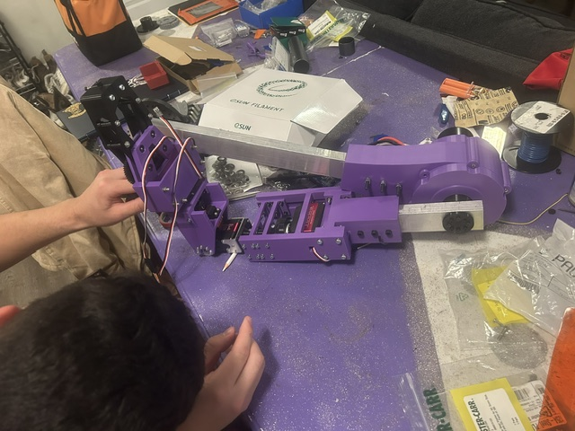

# Echo Arm – Intuitive Multi-DOF Robotic Arm

Echo Arm was my fourth-year engineering capstone project, completed in collaboration with the Western Engineering Mobile Advanced Robotics Society (WEMARS). The goal was to redesign the robotic arm used on the WEMARS competition rover and develop a faster, more intuitive method of controlling it during tasks such as retrieving objects, operating controls, and manipulating tools.

The completed system is a multi-degree-of-freedom robotic arm featuring a redesigned elbow joint, wrist, and end effector. Instead of controlling each joint individually using joysticks, the arm uses vision-based human pose tracking to map an operator’s arm movements to the robotic arm. This reduces the mental effort required to operate the arm and allows competition tasks to be completed more naturally.

The final prototype successfully demonstrated object retrieval and block-stacking tasks while supporting a 3 kg payload. The project involved mechanical design, CAD, motor and gearbox selection, torque calculations, finite element analysis, additive manufacturing, control-system development, assembly, and physical prototype testing.

## My Contributions

My primary responsibility was the mechanical design and development of the elbow joint and end effector. I also assisted with the wrist design, particularly the components responsible for transmitting motor torque through the wrist assembly.

### Elbow Joint

I designed a two-stage, 64:1 planetary gearbox for the elbow joint. The gearbox was developed to provide the torque required to lift a 3 kg payload while remaining compact enough for integration into the rover arm.

My work included:

- Calculating the elbow’s gravitational and dynamic torque requirements
- Applying gearbox efficiency and service factors to determine the required design torque
- Selecting the motor and gearbox reduction
- Designing the planetary gearbox and its internal components in CAD
- Performing finite element analysis on critical components
- Prototyping and manufacturing the gearbox using 3D-printed parts
- Assembling the mechanism and validating its performance through load testing

Testing showed that the completed gearbox achieved approximately 73.5% efficiency and provided sufficient torque to lift the required payload.

### End Effector

I designed a parallel four-bar linkage gripper that maintains the orientation of its gripping surfaces as it opens and closes. This design allows the arm to grasp objects securely while also interacting with smaller competition features such as buttons and levers.

My work included:

- Comparing multiple gripper concepts using a design decision matrix
- Developing the linkage geometry and mechanical layout
- Designing replaceable gripping attachments for different competition tasks
- Performing structural and loading analysis
- Iterating the design to improve strength, range of motion, and manufacturability
- Manufacturing, assembling, and testing the final mechanism

### Wrist Torque Transmission

I assisted with the mechanical development of the wrist, focusing on transmitting torque from the wrist servos to the rotating joints. During prototype testing, the original 3D-printed transmission shaft experienced significant torsional compliance, causing delayed movement and reducing the responsiveness of the end effector.

I helped refine the transmission system by incorporating steel tubing and improving the pinned connections between the servo, transmission shaft, and wrist joint. The revised design reduced the unsupported shaft length, increased torsional stiffness, and minimized backlash between motor movement and end-effector response.

## Project Results

- Fully functional multi-DOF robotic arm integrated with the WEMARS rover
- Successful object retrieval and block-stacking demonstrations
- 3 kg payload capacity
- 73.5% measured elbow gearbox efficiency
- Vision-based human pose tracking for intuitive operator control
- Custom-designed elbow gearbox, wrist assembly, and four-bar linkage gripper
